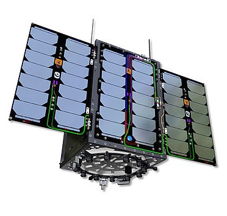
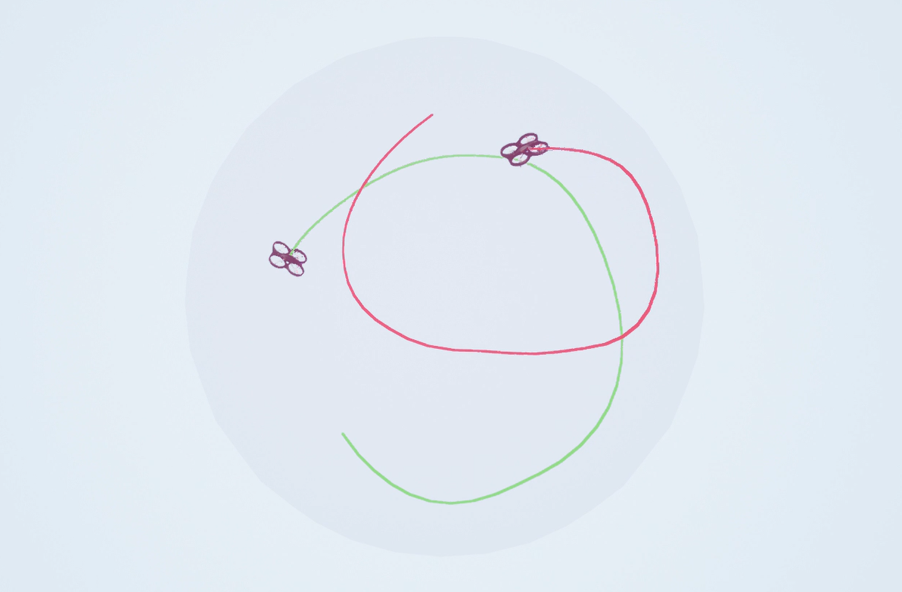

# Hey, I'm Hernán!

* Master’s graduate in **Telecommunications Engineering** from **Universidad Politécnica de Madrid (UPM)** 🇪🇸  
* Currently pursuing a **Master’s in Computer Science** at the **Illinois Institute of Technology**, Chicago 🇺🇸  
* Worked on the **UPMSat-3** mission-critical software and **AI-driven systems** at the STRAST research group (UPM)  
* Tech stack: `C`, `Python`, `Java`, `JavaScript`, `MATLAB`, `Docker`, `Kubernetes`, `Git`, `LaTeX`  
* Passionate about embedded systems, satellite software, and machine learning applications  

## About Me
**Researcher at STRAST group (Feb 2023 – Jul 2025)**  
- Designed and implemented mission-critical software in C for the UPMSat-3 satellite, integrating FreeRTOS, communication protocols, and physical interfaces across multiple onboard computers.  
- Performed rigorous integration testing in a cleanroom environment to ensure reliable flight-to-ground communication, collaborating with a multidisciplinary team.  
- Researched AI-based safety-critical systems using Python, applying reinforcement learning (PPO, SAC) and Curriculum Learning for autonomous drone navigation.

## Education
- **Master’s in Computer Science**, Illinois Institute of Technology, Chicago (2025–2026)  
- **Master’s in Telecommunications Engineering**, UPM – Madrid, Spain (2024–2026)  
  - GPA: 8.07 / 10 — Top 30% with Honor Distinctions  
- **Bachelor’s in Telecommunication Technologies and Services**, UPM – Madrid, Spain (2020–2024)  
  - GPA: 3.63 / 4 — Top 27% with Honor Distinctions  
  - Final Project: **"UPMSat-3 Satellite: Development of the Computer Platform"** (Grade: 10/10, Honor Distinction)  

## 🛰️ Research Projects: UPMSat-3 &  RL drone controller

&nbsp;&nbsp;&nbsp;

> Click the images above to learn more about the **UPMSat-3** satellite project and the **RL drone controller** system research based on Microsoft AirSim.

## 📌 Featured Repositories

I have these six projects **pinned on my GitHub profile** as highlights from my Bachelor studies and personal exploration — a mix of academic work and fun challenges:

| Project                                                                         | Description                                                                                                    | Tech & Stats                                                                                                                                                                            |
| ------------------------------------------------------------------------------- | -------------------------------------------------------------------------------------------------------------- | --------------------------------------------------------------------------------------------------------------------------------------------------------------------------------------- |
| [PERRETINA](https://github.com/hernaangq/PERRETINA)                             | A wearable digital system project with infrared NEC frame reception, RGB LED control, and sensor integration.  |                                 |
| [DIY4rent-G8](https://github.com/hernaangq/DIY4rent-G8)                         | A full-stack tool rental marketplace app with Java Spring Boot backend and React frontend.                     |                      |
| [ServerNetworkDeployment](https://github.com/hernaangq/ServerNetworkDeployment) | A deployment and server configuration project created for the CDPS course at ETSIT‑UPM (2023–2024).            |   |
| [WebDeployments](https://github.com/hernaangq/WebDeployments)                   | A full-stack web application deployment project focused on microservices and cloud orchestration.              |              |
| [MyQuizzes-SwiftApp](https://github.com/hernaangq/MyQuizzes-SwiftApp)           | A native iOS quiz app built with Swift and SwiftUI, focusing on UI design, state management, and navigation.   |           |
| [MedTecServer](https://github.com/hernaangq/MedTecServer)                       | A backend server using Spring Boot, providing RESTful APIs for healthcare data management and medical devices. |                    |

### 📊 GitHub Stats

  

